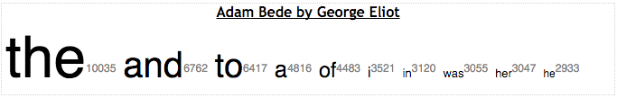
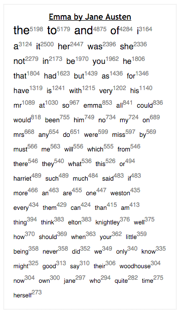
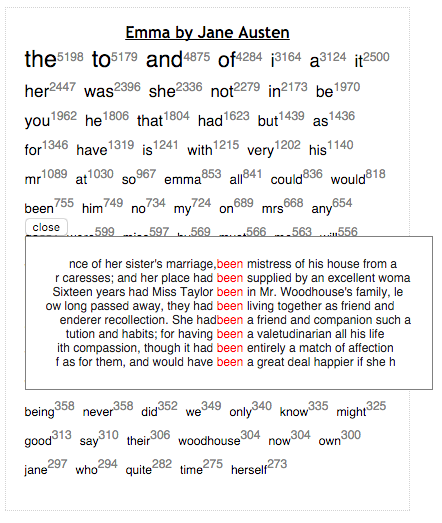

# Word Cloud

A visualization that displays a word cloud view given a list of scored tokens. It also incorporates a keyword in context view that is activated on click.







# Usage

There are two primary ways to use this component. Via `script` tags, which is suitable for beginners, or as a react component for those more experienced in web development.

## Via Script Tags

To use the component via script tags. Download this repository and look in the `dist` folder. There are two files there of particular note

 - `word_cloud.js` - The component.

 - `word_cloud.deps.js` - The dependencies for the file above split out into a separate file.

All of these files are minified which may make them hard to read. So they all have corresponding source maps that end in `.map`.

You should copy both these files into your project.

`Sample HTML file — This is your index.html or similar`
```html
<!DOCTYPE html>
<meta charset="utf-8">
<html>
<head>
  <title></title>
  <script type="text/javascript" src="./word_cloud.deps.js"></script>
  <script type="text/javascript" src="./word_cloud.js"></script>
</head>

<body>
  <div id='main'></div>
</body>

<script type="text/javascript">
  // This config can be loaded from an external location using ajax.
  var config = {
    "kwicContextSize": 30
  };

  // The data can be loaded from an external location.
  var data = [
    {
      "id": "eliot_adam",
      "name": "Adam Bede by George Eliot",
      "tokens": [
        ["the",10035],
        ["and",6762],
        ["to",6417],
        ["a",4816],
        ["of",4483],
        ["i",3521],
        ["in",3120],
        ["was",3055],
        ["her",3047],
        ["he",2933]
      ]
    }
  ]

  // Note this is only a sample of the text.
  var kwicData = [
    {
      "id": "eliot_adam",
      "name": "Adam Bede by George Eliot",
      "text": "ADAM BEDE\nby George Eliot\nBook One\nChapter I\nThe Workshop\nWith a single drop of ink for a mirror, the Egyptian sorcerer undertakes\nto reveal to any chance comer far-reaching visions of the past. This is\nwhat I undertake to do for you, reader. With this drop of ink at the\nend of my pen, I will show you the roomy workshop of Mr. Jonathan Burge,\ncarpenter and builder, in the village of Hayslope, as it appeared on the\neighteenth of June, in the year of our Lord 1799.\nThe afternoon sun was warm on the five workmen there, busy upon doors\nand window-frames and wainscoting. A scent of pine-wood from a tentlike\npile of planks outside the open door mingled itself with the scent of\nthe elder-bushes which were spreading their summer snow close to\nthe open window opposite; the slanting sunbeams shone through the\ntransparent shavings that flew before the steady plane, and lit up the\nfine grain of the oak panelling which stood propped against the wall.\nOn a heap of those soft shavings a rough, grey shepherd dog had\nmade himself a pleasant bed, and was lying with his nose between his\nfore-paws, occasionally wrinkling his brows to cast a glance at the\ntallest of the five workmen, who was carving a shield in the centre of\na wooden mantelpiece. It was to this workman that the strong barytone\nbelonged which was heard above the sound of plane and hammer singing--\nAwake, my soul, and with the sun\nThy daily stage of duty run;\nShake off dull sloth...\nHere some measurement was to be taken which required more concentrated\nattention, and the sonorous voice subsided into a low whistle; but it\npresently broke out again with renewed vigour--\nLet all thy converse be sincere,\nThy conscience as the noonday clear.\nSuch a voice could only come from a broad chest, and the broad chest\nbelonged to a large-boned, muscular man nearly six feet high, with a\nback so flat and a head so well poised that when he drew himself up\nto take a more distant survey of his work, he had the air of a soldier\nstanding at ease."
    }
  ]

  // The container we will render our component into.
  var container = document.querySelector("#main");

  // Package it all up and call the show function
  var opts = {
    config: config,
    data: data,
    kwicData: kwicData,
    container: container
  }
  WordCloud.show(opts)
</script>
</html>
```

You can open this file in your browser to see it in action, but you will probably want to move to using a webserver, a simple one is the one built into python `python -m SimpleHTTPServer`.

## As a react component

This module is implemented as a react component and can be used as such. Example code below

```jsx
ReactDOM.render(
  <WordCloud
    config={config}
    data={data}
    kwicData={kwicData}
  />,
  document.querySelector("#main"));
```

You would most likely get the component via NPM using `npm install word-cloud`. Since the project is written in ES6 and React/JSX you will need a build system that can transpile these to ES5. We use *webpack*, see this repo and our webpack.config.js for guidance.

See below for documentation of parameters

# Parameters

 - config [Object]:
  - config.kwicContextSize [Integer]: The number of characters to display around a token when showing the keyword in context view.
  - config.kwicCaseSensitive [Boolean]: Whether the keyword in context view is case sensitive when searching for matches.
  - config.kwicLimit [Integer]: The maximum number of matches to show in the keyword in context view.
 - data [Array]: See [data/data.json](data/data.json) for an example
 - kwicData [Array]: See [data/kwic_data.json](data/kwic_data.json) for an example

# Customization

CSS can be used to customize the display of this component and it is expected that you would use css to customize the component to fit in your context (e.g. constrain the height of the component). See [this ](src/chart/wordcloud.css) [and this stylesheet](src/components/wordcloud/wordcloud.css) for a sense of what styles you can define.

# Dev Workflow

The project is written in ES6/ES2015 with React and JSX and uses webpack for building and webpack-dev-server during development.

 These can be accessed via npm scripts

`npm start` - to start the server in dev mode (with a watcher). Go to localhost:8080/demo.html when this is running to start execution from html.html. You can change the value in sample_data and refresh to see a change in the vis.

`npm run build-fast` - execute the build without minification.

`npm run build-all` - execute the build.

See `webpack.config.js` and `webpack.dev.config.js` for details.
